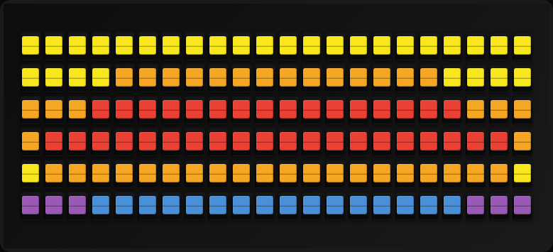
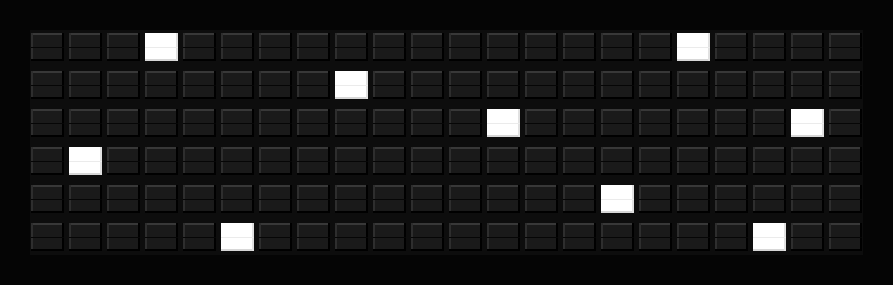
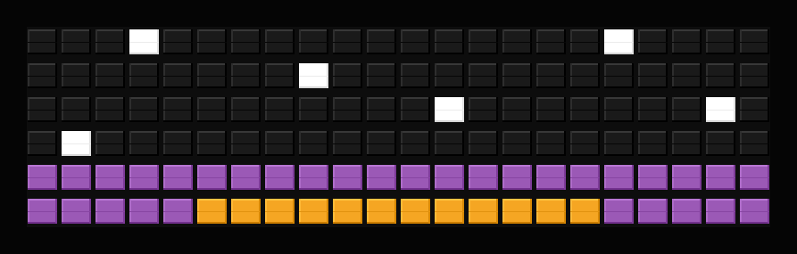
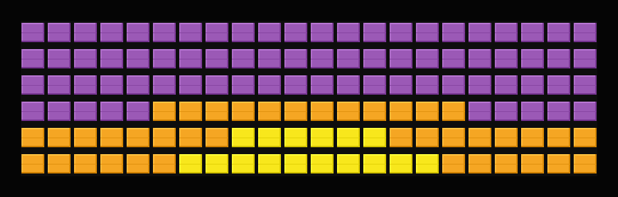
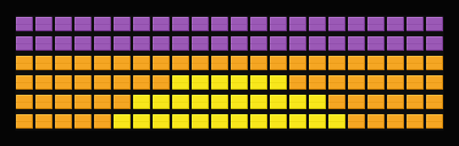
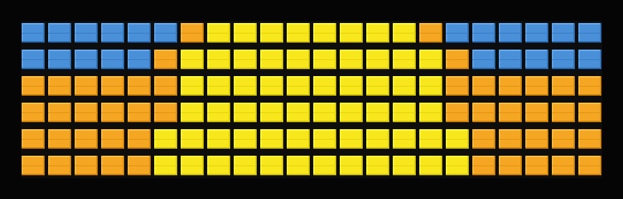
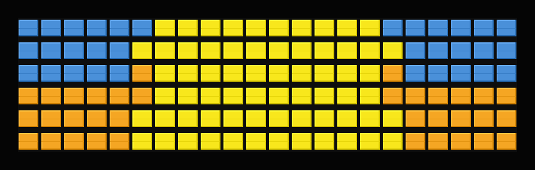
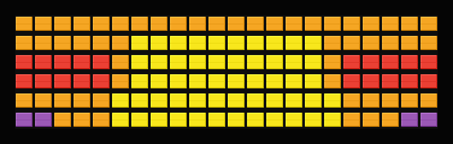
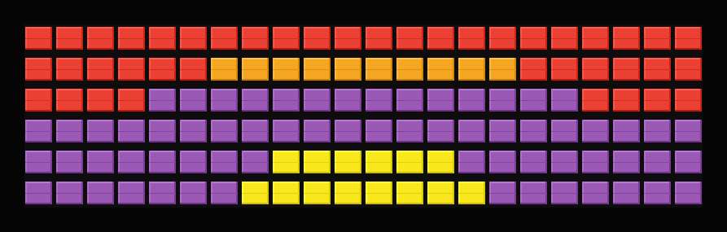
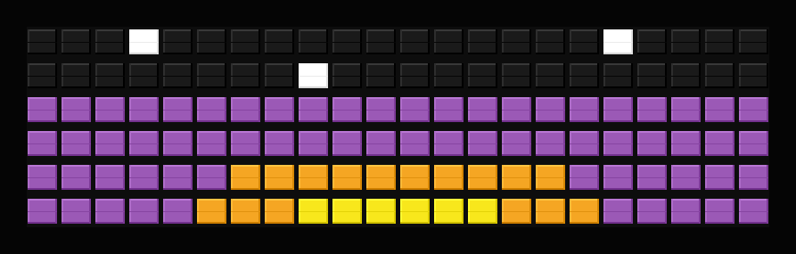

# Sun Art Plugin

Display a full-board sun scene that changes based on the sun's position throughout the day. The sun rises from the horizon to full at noon, then sets back to a starry night.

The scene is re-rendered procedurally at whatever geometry the board reports — a Note (15x3), a Flagship (22x6) or a note array up to 120x24 (which is what a FiestaPanel is). Nothing is tiled, cropped or letterboxed: the horizon is a fraction of the board's height, the sun disc is centred on its width, and star density scales with its area.



**→ [Setup Guide](./docs/SETUP.md)** - Location configuration

## Overview

The Sun Art plugin generates visual patterns representing the sun's position using latitude/longitude coordinates. It calculates accurate sun positions using the `astral` library and creates 12 distinct patterns showing the sun's progression throughout the day.

## Features

- **Full-board scenes**: colour tiles filling the board, at the board's own size
- **Real-time sun tracking**: Calculates sun position based on your location
- **12 distinct stages**: Smooth progression showing sun rising/setting line-by-line
- **Night sky with stars**: White dots scattered on black background
- **Dual format output**: String format (with color markers) and array format (nested arrays)
- **Location-based**: Uses latitude/longitude for accurate calculations
- **Timezone aware**: Uses general timezone settings for proper time calculations

## How It Works

### Sun Position Calculation

The plugin uses the `astral` library to calculate:
- **Sun elevation**: Angle of the sun above/below the horizon (-90° to 90°)
- **Sun azimuth**: Direction of the sun (0° to 360°)
- **Sunrise/sunset times**: Accurate times for your location and date

### Sun Stage Determination

The plugin uses 12 stages to show the sun rising line-by-line then setting line-by-line:

**Rising (before solar noon):**

| Stage | Elevation | Description |
|-------|-----------|-------------|
| **Night** | < -12° | Black sky with white stars |
| **Late Night** | -12° to -6° | Stars with faint glow at horizon |
| **Dawn** | -6° to -1° | Purple sky, orange glow, sun approaching |
| **Early Sunrise** | -1° to 3° | Sun peeking above the horizon |
| **Sunrise** | 3° to 10° | Sun clearing the horizon, blue sky appearing |
| **Morning** | 10° to 30° | Sun high, mostly blue sky |
| **Noon** | > 30° | Sun at its highest, brightest with white core |

**Setting (after solar noon):**

| Stage | Elevation | Description |
|-------|-----------|-------------|
| **Afternoon** | 10° to 30° | Sun lowering, blue sky |
| **Sunset** | 3° to 10° | Sun setting, orange/red sky |
| **Late Sunset** | -1° to 3° | Sun almost gone, red/purple sky |
| **Dusk** | -6° to -1° | Sun just set, afterglow fading |
| **Twilight** | -12° to -6° | Fading to night, stars appearing |
| **Night** | < -12° | Black sky with white stars |

### Pattern Generation

Each stage is a **style**, not a picture: sky and ground colour bands, a
horizon position, a disc offset and radius, and a star flag (see
`STAGE_STYLES` in `__init__.py`). The scene is drawn from those proportions at
the board's own `rows` x `cols` on every fetch, so the same stage reads
correctly on a Note and on a 120x24 panel.

- **Night/Twilight**: Black background with scattered white stars
- **Dawn/Dusk**: Purple/violet sky with orange glow at horizon
- **Sunrise/Sunset stages**: Yellow sun column grows/shrinks row-by-row
- **Morning/Afternoon**: Sun fills most of the display, blue sky at top
- **Noon**: Full-height sun with white core (brightest)

**Pattern Design Features:**
- **Sun disc** centred on the board's width, its height a fraction of the
  board's height and its width following the tile aspect (a split-flap is
  about twice as tall as it is wide), capped so a squarer board does not let
  a round disc swallow the whole scene
- **Stars at night** at a fixed density per tile of sky, placed from a seed
  derived from the stage and the geometry, so a board's sky is stable between
  refreshes but is not a crop of another board's
- **Color tiles only** (codes 63-71) - no character symbols
- **Smooth progression**: each stage moves the disc relative to the horizon

## Stage Examples

The scene changes through 12 distinct stages. The examples below are Flagship (22x6) renders; every stage is re-rendered at the board's own proportions, so the same stage looks like this on any board.

### Night

*Black sky with scattered white stars - sun well below horizon*

### Late Night

*Stars with faint violet/orange glow at horizon - pre-dawn*

### Dawn

*Purple sky with orange glow - sun approaching from below*

### Early Sunrise

*Sun peeking above the horizon*

### Sunrise

*Sun clearing the horizon, blue sky appearing*

### Morning

*Sun high, blue sky dominant*

### Noon

*Sun at its highest, brightest with white core*

### Afternoon

*Sun lowering, the mirror of morning*

### Sunset

*Sun setting, orange/red sky*

### Late Sunset

*Sun almost gone, red/purple sky*

### Dusk

*Sun just set, red/orange fading to purple*

### Twilight

*Fading to night, stars appearing*

## Template Variables

### Simple Variables

```
{{sun_art.sun_art}}              # Full-screen pattern as string (newline-separated with color markers)
{{sun_art.sun_stage}}            # Current sun stage name (night, dawn, sunrise, etc.)
{{sun_art.sun_position}}         # Sun elevation angle in degrees (e.g., "45.2")
{{sun_art.is_daytime}}            # Boolean: true if sun is above horizon
{{sun_art.time_to_sunrise}}      # Time until next sunrise (HH:MM format, e.g., "06:30")
{{sun_art.time_to_sunset}}       # Time until next sunset (HH:MM format, e.g., "12:15")
```

### Array Format

The `sun_art_array` variable is available as a nested array (`board.rows` rows x `board.cols` columns) of character codes (0-71). This is useful for programmatic access or custom rendering.

## Configuration

### Required Settings

- **Latitude** (-90 to 90): Your location's latitude
- **Longitude** (-180 to 180): Your location's longitude

### Optional Settings

- **Refresh Interval** (seconds, default: 300): How often to recalculate sun position and update pattern
  - Minimum: 60 seconds
  - Recommended: 300 seconds (5 minutes) for smooth transitions

### Location Discovery

The plugin supports one-click location discovery via the browser's geolocation API. When configuring latitude/longitude in the web UI, a location button automatically appears that uses your browser's location to populate the coordinates.

## Technical Details

### Sun Calculation

The plugin uses the `astral` library (v3.2+) which provides:
- Accurate sun position calculations based on:
  - Date and time
  - Latitude/longitude coordinates
  - Timezone (from general settings)
- Accounts for atmospheric refraction (sun appears above horizon before actual sunrise)
- Handles edge cases (polar regions, equator, date boundaries)

### Pattern Format

**String Format:**
- Newline-separated lines, one per board row
- Color markers: `{red}`, `{orange}`, `{yellow}`, `{blue}`, `{black}`, `{white}`
- Character codes: Regular characters (A-Z, 0-9, punctuation)
- Example: `"{yellow}{yellow}O{yellow}{yellow}\n{orange}{orange}{orange}..."`

**Array Format:**
- Nested list: `[[code, code, ...], [code, code, ...], ...]`
- `board.rows` rows, `board.cols` columns
- Character codes: 0-71 (see `src/board_chars.py`)

### Caching

Sun calculations are cached per day to reduce computation:
- Cache invalidated at midnight (new day)
- Cache also respects refresh interval (won't recalculate if within refresh window)
- Cache includes calculated timestamp for age checking
- The cache holds the sun **position** only, never the rendered scene. Rendering
  is board-specific, and a cached frame here would short-circuit ahead of
  `PluginBase`'s geometry-keyed cache and hand one board another's picture.

### Performance

- Pattern generation is fast (no external API calls)
- Sun calculations are lightweight (local computation)
- Recommended refresh interval: 5 minutes (balances accuracy and performance)

## Example Usage

### Basic Display

Use the `sun_art` variable directly in a template:

```
{{sun_art.sun_art}}
```

This will fill the board with the current sun scene, at the board's own size.

### With Stage Information

```
{{sun_art.sun_stage}}
{{sun_art.sun_art}}
```

Shows the current stage name followed by the pattern.

### Time to Events

```
SUN: {{sun_art.sun_stage}}
RISE: {{sun_art.time_to_sunrise}}
SET: {{sun_art.time_to_sunset}}
```

## Dependencies

- `astral>=3.2`: Sun position calculations
- `pytz`: Timezone handling (already in project)

## API Reference

### `SunArtPlugin` Class

Main plugin class that extends `PluginBase`.

**Methods:**

- `fetch_data()`: Main data fetching method
  - Returns: `PluginResult` with sun art data
  - Calculates sun position, determines stage, generates pattern

- `_calculate_sun_position(lat, lon, dt, tz)`: Calculate sun elevation and azimuth
  - Returns: Dictionary with elevation, azimuth, is_rising, sunrise, sunset, noon

- `_determine_sun_stage(elevation, is_rising)`: Classify current sun stage
  - Returns: Stage name string

- `board_size()`: The bound board's `(rows, cols)`, defaulting to a Flagship
  when no board is bound
  - Returns: Tuple of (rows, cols)

- `_generate_pattern(stage, rows, cols)`: Render the stage at that geometry
  - Returns: Nested list of character codes, `rows` x `cols`

- `_pattern_to_string(pattern)`: Convert array to string format
  - Returns: Newline-separated string with color markers

- `_calculate_next_events(lat, lon, now, tz)`: Calculate time to next sunrise/sunset
  - Returns: Tuple of (time_to_sunrise, time_to_sunset) as "HH:MM" strings

## Testing

The plugin includes comprehensive tests with >80% coverage:

- Configuration validation
- Sun position calculations
- Stage determination (all 12 stages)
- Pattern generation (every stage fills every board shape exactly)
- String and array format outputs
- Error handling
- Edge cases (polar regions, equator, date boundaries)

Run tests:
```bash
python scripts/run_plugin_tests.py --plugin=sun_art
```

## Contributing

When modifying this plugin:
- Maintain >80% test coverage
- Update documentation if adding new stages or variables
- Test with various locations (equator, poles, different timezones)
- Verify pattern generation fills the board exactly at every geometry
  (`tests/test_board_geometry.py` runs FiestaBoard's shared conformance suite)
